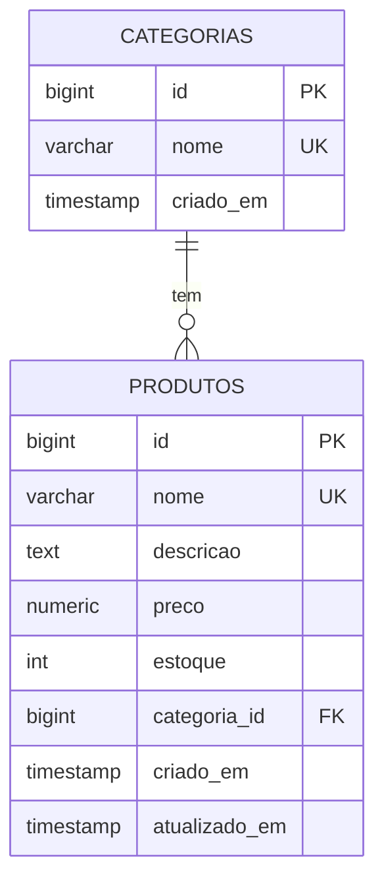

<div align="center">

# 🛒 Gerenciador de Produtos API


*Solução para o desafio de backend [gerenciador-produtos](https://github.com/Francisco-Montalvao/backend-challenges/tree/main/junior/crud/gerenciador-produtos) — API REST com CRUD completo de produtos e categorias, validações e tratamento de erros padronizado.*

</div>

---

## 📌 Índice

- [🚀 Tecnologias](#-tecnologias)
- [📊 Regras de negócio](#-regras-de-negócio)
- [🛡️ Validações e Exceções](#-validações-e-tratamento-de-exceções)
- [📑 Endpoints](#-endpoints)
- [💡 Exemplos de uso](#-exemplos-de-uso)
- [▶️ Como Executar](#-como-executar)
- [🗄️ Modelo de dados](#-modelo-de-dados)
- [📂 Estrutura do Projeto](#-estrutura-do-projeto)

---

## 🚀 Tecnologias

| Tecnologia | Descrição |
|---|---|
| Java 21 | Linguagem principal |
| Spring Boot 4.0.6 | Framework web |
| Spring Data JPA | Persistência e acesso a dados |
| Spring Validation | Validação de entrada via Bean Validation |
| PostgreSQL | Banco de dados relacional |
| Lombok | Redução de boilerplate |

---

## 📊 Regras de negócio

- Nome de produto e de categoria devem ser **únicos**
- Preço deve ser **maior que zero**
- Estoque **não pode ser negativo**
- `categoria_id` deve referenciar uma **categoria existente**
- **Não é permitido deletar** uma categoria que possui produtos vinculados
- O `PUT` substitui o recurso por completo — **todos os campos são obrigatórios**
- Lista vazia retorna `200` com `[]`, nunca `404`

---

## 🛡️ Validações e Tratamento de Exceções

A API conta com validação estruturada dos dados de entrada via Bean Validation. Caso ocorram erros, um `GlobalExceptionHandler` intercepta e retorna respostas padronizadas.

<details>
<summary>🔴 <strong>400 Bad Request</strong> — erro de validação de campos</summary>

```json
{
  "timestamp": "2026-05-27T15:14:38.917029",
  "status": 400,
  "mensagem": "Erro de validação em campos",
  "erros": [
    {
      "campo": "preco",
      "mensagem": "preco tem que ser maior que zero"
    },
    {
      "campo": "estoque",
      "mensagem": "estoque nao pode ser negativo"
    }
  ]
}
```

</details>

<details>
<summary>🟡 <strong>404 Not Found</strong> — recurso não encontrado</summary>

```json
{
  "timestamp": "2026-05-27T15:13:13.922031",
  "status": 404,
  "mensagem": "produto com id 1 nao encontrado"
}
```

</details>

<details>
<summary>🟠 <strong>409 Conflict</strong> — nome duplicado</summary>

```json
{
  "timestamp": "2026-05-27T15:15:15.979381",
  "status": 409,
  "mensagem": "Já existe um produto com o nome Camiseta Azul"
}
```

</details>

---

## 📑 Endpoints

### Categorias

| Método | Endpoint | Descrição | Respostas |
|:---:|---|---|---|
| `POST` | `/categorias` | Cria uma categoria | `201` · `409` nome duplicado |
| `GET` | `/categorias` | Lista todas as categorias | `200` |
| `DELETE` | `/categorias/{id}` | Remove uma categoria | `204` · `404` · `400` com produtos vinculados |

### Produtos

| Método | Endpoint | Descrição | Respostas |
|:---:|---|---|---|
| `POST` | `/produtos` | Cria um produto | `201` · `400` · `404` |
| `GET` | `/produtos` | Lista todos os produtos | `200` |
| `GET` | `/produtos/{id}` | Busca produto por ID | `200` · `404` |
| `PUT` | `/produtos/{id}` | Atualiza produto por completo | `200` · `400` · `404` |
| `DELETE` | `/produtos/{id}` | Remove um produto | `204` · `404` |

---

## 💡 Exemplos de uso

### 🏷️ Criar categoria

```bash
curl -X POST http://localhost:8080/categorias \
  -H "Content-Type: application/json" \
  -d '{"nome": "Roupas"}'
```

**`201 Created`**
```json
{
  "id": 1,
  "nome": "Roupas",
  "criadoEm": "2026-05-21T10:00:00"
}
```

---

### 📦 Criar produto

```bash
curl -X POST http://localhost:8080/produtos \
  -H "Content-Type: application/json" \
  -d '{
    "nome": "Camiseta Azul",
    "descricao": "100% algodão, tamanho M",
    "preco": 49.90,
    "estoque": 100,
    "categoria_id": 1
  }'
```

**`201 Created`**
```json
{
  "id": 1,
  "nome": "Camiseta Azul",
  "descricao": "100% algodão, tamanho M",
  "preco": 49.90,
  "estoque": 100,
  "categoria": {
    "id": 1,
    "nome": "Roupas"
  },
  "criadoEm": "2026-05-21T10:30:00",
  "atualizadoEm": "2026-05-21T10:30:00"
}
```

---

### ✏️ Atualizar produto

```bash
curl -X PUT http://localhost:8080/produtos/1 \
  -H "Content-Type: application/json" \
  -d '{
    "nome": "Camiseta Azul",
    "descricao": "100% algodão, tamanho G",
    "preco": 54.90,
    "estoque": 80,
    "categoria_id": 1
  }'
```

**`200 OK`**
```json
{
  "id": 1,
  "nome": "Camiseta Azul",
  "descricao": "100% algodão, tamanho G",
  "preco": 54.90,
  "estoque": 80,
  "categoria": {
    "id": 1,
    "nome": "Roupas"
  },
  "criadoEm": "2026-05-21T10:30:00",
  "atualizadoEm": "2026-05-21T11:00:00"
}
```

---

## ▶️ Como executar

### Pré-requisitos

- Java 21+
- PostgreSQL rodando localmente

### 1. Configurar o banco de dados

Crie o banco antes de subir a aplicação:

```sql
CREATE DATABASE gerenciador;
```

### 2. Ajustar as credenciais

Edite `src/main/resources/application-dev.properties` com os dados do seu ambiente:

```properties
spring.datasource.url=jdbc:postgresql://localhost:5432/gerenciador
spring.datasource.username=seu_usuario
spring.datasource.password=sua_senha
```

> O Hibernate cria e atualiza as tabelas automaticamente via `ddl-auto=update`.

### 3. Rodar a aplicação

```bash
./mvnw spring-boot:run
```

A API estará disponível em `http://localhost:8080`.

---

## 🗄️ Modelo de dados



---

## 📂 Estrutura do projeto

```
src/main/java/com/francisco_montalvao/gprodutos/
├── controller/    # Recebe requisições e devolve respostas HTTP
├── service/       # Regras de negócio
├── repository/    # Acesso ao banco via Spring Data JPA
├── model/         # Entidades JPA (Produto, Categoria)
├── dto/           # Objetos de entrada (request) e saída (response)
├── mapper/        # Conversão entre entidade e DTO
└── exception/     # Exceções customizadas e handler global
```

---

<div align="center">

🧑‍💻 Desenvolvido por [Francisco Montalvao](https://github.com/Francisco-Montalvao)

Este projeto está sob a licença MIT. Veja o arquivo [LICENSE](LICENSE) para mais detalhes.

</div>
